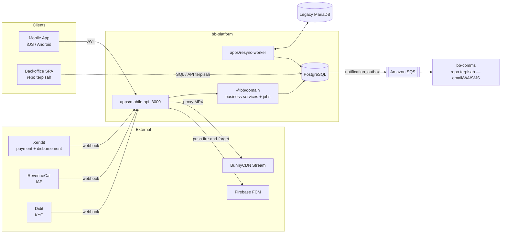

# 01 — Arsitektur

[⬅ Kembali ke index](README.md)

## 1. Stack

| Aspek | Teknologi |
|---|---|
| Bahasa | TypeScript (Node ≥ 20) |
| Framework HTTP | Express 4 |
| ORM | Prisma 5 |
| Database | PostgreSQL (ID = UUID v7) |
| Auth | JWT (access + refresh), grant OAuth-style di `/api/member/oauth/token` |
| Validasi | `class-validator` + `class-transformer` (DTO di edge) |
| OpenAPI | `class-validator-jsonschema` + registry custom (`bindRoute`) → Swagger UI `/api/docs` |
| Logger | pino |
| Test | Vitest (integration test pakai Postgres asli, **tanpa mock DB**) |
| Package manager | pnpm (monorepo workspace, `node-linker=hoisted`) |
| Build produksi | tsup per app |

Repo ini adalah **rewrite penuh** dari `tribelio-platform` (PHP/Cresenity). Kolom `legacyId Int? @unique` di hampir semua tabel adalah ID int untuk kompatibilitas mobile app lama — **bukan** kolom sisa yang boleh dihapus.

## 2. Layout monorepo (ADR-0001)

```
packages/
  db/        @bb/db        # Prisma client singleton + re-export @prisma/client
  common/    @bb/common    # exceptions, middlewares, openapi, serializers, services
                           #   (mailer/otp/settings/xendit), utils, events, config/{env,logger}
  domain/    @bb/domain    # business services & rules TANPA Express:
                           #   commerce, affiliate, subscription, notification, voucher,
                           #   post/comment services, jobs/, registerDomainListeners()
apps/
  mobile-api/          :3000   # API member-facing — modul HTTP per fitur
  notification-worker/         # ⚠️ shell kosong (belum diimplementasi) — push FCM saat ini
                               #   jalan in-process dari mobile-api (fire-and-forget)
  resync-worker/               # sync inkremental legacy MariaDB → PG (tool transisi)
prisma/                        # SATU sumber kebenaran: schema.prisma + migrations + seeds
tests/setup.ts                 # setup vitest bersama; spec di apps/*/tests/
```

Aturan lapisan: **`apps/*` boleh depend ke `packages/*`, tidak sebaliknya.** `@bb/domain` tidak tahu-menahu soal Express — dia dipakai baik oleh `mobile-api` (via controller) maupun oleh worker & jobs.

## 3. Diagram komponen



- **bb-comms** (ADR-0002): pengiriman email/WA-OTP/SMS ada di repo terpisah. Backend menulis baris `notification_outbox` dalam transaksi yang sama dengan mutasi domain (transactional outbox), daemon relay (`pnpm relay:comms`) mem-publish ke **Amazon SQS** (lokal: ElasticMQ), bb-comms yang eksekusi. *(ADR aslinya menyebut RabbitMQ; transport aktual sudah SQS.)* Detail relay: [operations/workers.md](operations/workers.md) · dokumentasi service-nya ada di repo bb-comms (`docs/README.md`).
- **resync-worker**: menjaga data hasil migrasi tetap segar selama masa transisi (legacy masih ditulisi). Dibuang setelah cutover. Detail: [`docs/specs/legacy-resync-plan.md`](../specs/legacy-resync-plan.md).

## 4. Module pattern (mobile-api)

Setiap fitur = satu folder `apps/mobile-api/src/modules/<feature>/` yang mengekspor `AppModule { name, prefix, routes() }` dan didaftarkan di `core/register-modules.ts`. Semua modul di-mount di bawah **`/api`**.

| Prefix | Modul |
|---|---|
| `/api/member` | auth, account, member, profile, location, upload, banner, product, media, commission, affiliate, commerce, topic, post, comment, reply, network, report, notification |
| `/api/subscription` | subscription |
| `/api/webhook` | webhook (Xendit invoice/disbursement, RevenueCat, Didit) |
| `/api/ingest` | ingest (purchase pihak ketiga: IAP/Scalev/Lynk.id) |
| `/api/tracking` | tracker (ingest listening session) |
| `/api/user` | tracker (stats/home-screen metrics) |

Anatomi modul:

```
modules/<feature>/
  <feature>.module.ts       # AppModule { name, prefix, routes }
  <feature>.routes.ts       # DI manual: new Controller(new Service(...)) + bindRoute()
  <feature>.controller.ts   # tipis: baca req → panggil service → ok()/fail()
  dto/*.dto.ts              # class-validator DTOs
  <feature>.serializer.ts   # bentuk response (opsional)
```

Konvensi wajib:

- **Routing selalu lewat `bindRoute()`** (`@bb/common/openapi/route-binder`) — satu panggilan mendaftarkan route Express **dan** entri OpenAPI. Jangan `router.post(...)` langsung.
- **DI manual** di `*.routes.ts` — tidak ada container (tsyringe dkk. sengaja tidak dipakai).
- **Path mengikuti mobile client legacy**, bukan REST ideal (contoh: `/api/member/oauth/token`, `/api/member/product/checkout/submit`).
- Service layer fitur yang dipakai lintas app (commerce, affiliate, subscription, notification, post/comment) hidup di **`@bb/domain`**, bukan di dalam modul.

## 5. Request lifecycle

```
Request
  → middleware global (json parser, logger, dst.)
  → authGuard            # baca Authorization: Bearer <jwt> → req.user (AuthenticatedUser)
  → validateDto(Dto)     # transform + validasi req.body (atau req.query dgn varian 'query')
  → Controller.handler   # tipis
  → Service (@bb/domain atau lokal modul)  # business logic + Prisma
  → ok()/okCreated()/okPaginated()         # envelope sukses
  ⤷ throw *Exception → errorHandler        # envelope error
```

**Response envelope** (spec penuh: [`docs/specs/api-envelope.md`](../specs/api-envelope.md)):

```jsonc
{ "success": true,  "data": { ... }, "meta": { "pagination": { "page": 1, "perPage": 10, "total": 42, "totalPages": 5 } }, "error": null }
{ "success": false, "data": null, "meta": null, "error": { "code": "VALIDATION_ERROR", "message": "...", "details": [ ... ] } }
```

Exception → HTTP: `BadRequestException`→400, `UnauthorizedException`→401, `ForbiddenException`→403, `NotFoundException`→404; error tak tertangkap → 500 `INTERNAL_ERROR`.

## 6. Event bus (in-process)

Mutasi domain memancarkan event sinkron in-process; listener didaftarkan sekali via `registerDomainListeners()` (`@bb/domain/listeners.ts`). Definisi event ada di `@bb/common/src/events/`.

| Grup | Event | Contoh side effect (listener) |
|---|---|---|
| Commerce | `commerce.payment.success` | enrollment course, hitung komisi affiliate, redeem voucher, aktivasi subscription, notifikasi |
| | `commerce.payment.expired` / `.failed` / `.refunded` | notifikasi, void komisi, putus subscription (refund) |
| Affiliate | `affiliate.commission.created` | notifikasi komisi masuk |
| Subscription | `subscription.activated` / `.renewed` / `.canceled` / `.expired` | notifikasi + email (via outbox), enrollment lazy |
| Community | `post.published`, `post.liked`, `comment.created`, `comment.liked` | notifikasi feed + FCM |
| Network | `network.member.requested` / `.joined` / `.approved` | notifikasi |

Sifatnya **at-least-once di level konsumen**: listener yang menulis data memakai guard idempoten (unique constraint / ledger — lihat pola "claim table" di [02 — Database §3](02-database.md#3-pola-desain-yang-berulang)).

## 7. Background jobs

Ada di `packages/domain/src/jobs/`, dijalankan oleh scheduler/worker:

| Job | Tugas |
|---|---|
| `expire-pending-payments` | Meng-expire payment/transaksi PENDING yang lewat `expiredAt` |
| `affiliate-pending-to-balance` | Memindah komisi PENDING → BALANCE setelah 7 hari |
| `execute-approved-disbursements` | Menyapu disbursement yang sudah di-approve backoffice → eksekusi Xendit (re-check KYC saat eksekusi) |
| `subscription-expire` | Menutup subscription lewat grace → status EXPIRED (jalan **sebelum** reminder) |
| `subscription-renewal-reminder` | Reminder H-7/H-3/H-1 sebelum expiry (dedupe per siklus expiry) |

## 8. Konfigurasi

- **Env vars**: satu deklarasi per variabel di `packages/common/src/config/env.ts` (helper `required('FOO')`).
- **Runtime settings**: tabel `app_settings` (key-value, cache TTL pendek) untuk angka yang boleh berubah tanpa deploy — mis. `disbursement.minBalance`, `disbursement.fee`, `kyc.minBalance`, `subscription.graceDays`. Dibaca via `SettingsService`.

---

Selanjutnya: [02 — Database](02-database.md)
