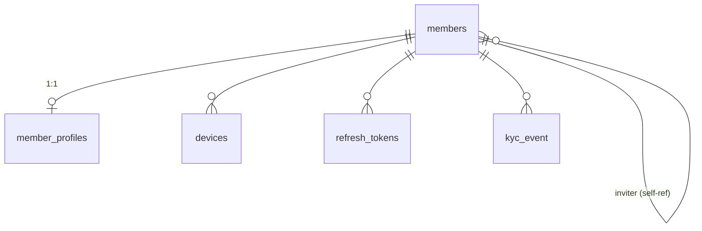
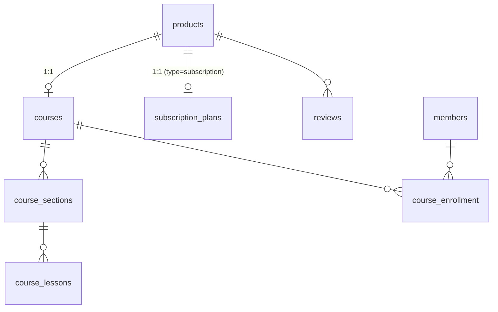
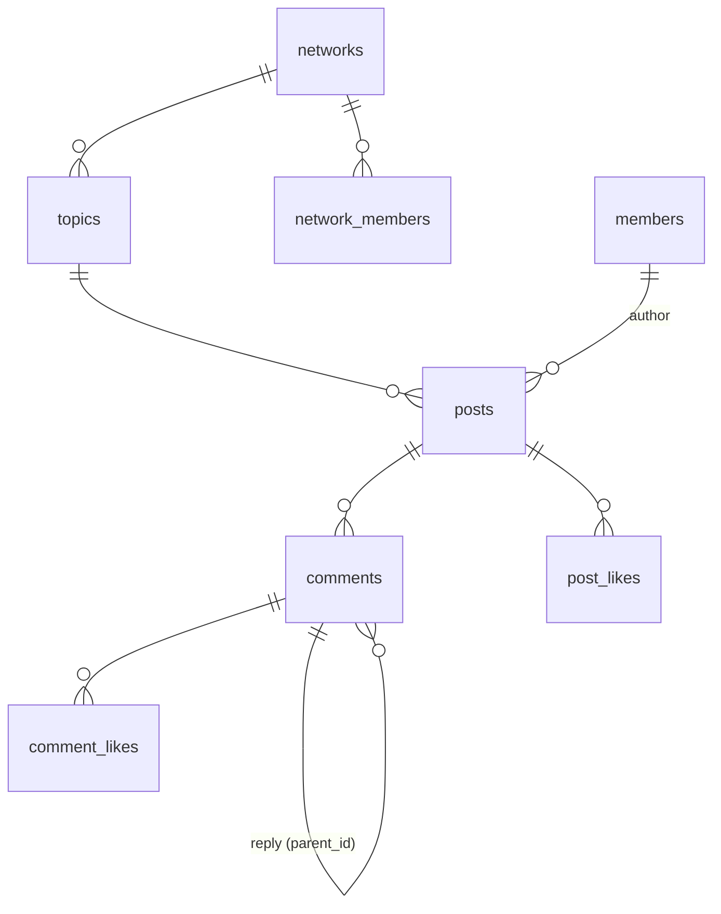
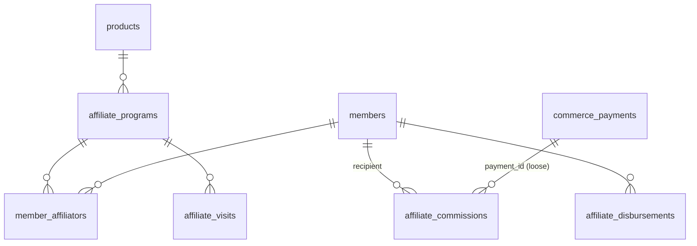

# 02 — Database

[⬅ Kembali ke index](README.md)

Sumber kebenaran tunggal: [`prisma/schema.prisma`](../../prisma/schema.prisma) (61 model). Halaman ini memetakan model ke domain, menjelaskan peran tiap tabel, dan mendokumentasikan konvensi + pola desain yang berulang. Detail kolom lengkap selalu lihat schema langsung — kolomnya beranotasi komentar.

## 1. Konvensi schema

| Konvensi | Detail |
|---|---|
| Primary key | UUID v7 (`@default(uuid(7)) @db.Uuid`) di semua tabel |
| `legacyId Int? @unique` | ID int dari legacy MariaDB — dipakai mobile app lama sebagai identifier. **Wajib terisi saat migrasi, jangan dihapus** |
| Penamaan | Model `PascalCase`, tabel/kolom fisik `snake_case` via `@map`/`@@map` |
| Timestamp | `timestamp` tanpa timezone, diisi **UTC dari app clock**. `createdAt @default(now())`, `updatedAt @updatedAt` |
| Soft delete | Flag (`isDeleted`, `isActive`) — bukan hard delete, demi parity feed legacy |
| Enum | Campuran: enum Postgres (`CommerceTransactionStatus`, `SubscriptionStatus`, dst.) untuk status yang stabil; string bebas (`kycStatus`, `affiliateBased`) untuk yang mungkin bertambah tanpa DDL |
| Multi-tenant | **Tidak ada.** Single-tenant — kolom `org_id`/`network_account_id` legacy tidak diporting |

## 2. Peta domain (61 model)

### 2.1 Member & Auth (7)

| Tabel | Model | Peran |
|---|---|---|
| `members` | `Member` | Akun member: kredensial, profil ringkas, state affiliate (`affiliateBased`, `inviterId`), bank payout, seluruh state KYC |
| `kyc_event` | `KycEvent` | Audit trail append-only transisi status KYC (AML) |
| `member_profiles` | `MemberProfile` | Alamat + relasi lokasi (1:1 member) |
| `devices` | `Device` | Device member + token FCM |
| `refresh_tokens` | `RefreshToken` | JWT refresh token per member/client |
| `otp_codes` | `OtpCode` | OTP (hash) per target+purpose |
| `pra_members` | `PraMember` | Pre-registration: identitas + `attributionContext` marketing, dibawa ke step register |

### 2.2 Comms outbox (3)

| Tabel | Model | Peran |
|---|---|---|
| `notification_outbox` | `NotificationOutbox` | Transactional outbox pesan keluar (WA/email/SMS, siap FCM) → relay → Amazon SQS → bb-comms |
| `comms_delivery` | `CommsDelivery` | Log attempt kirim — **ditulis bb-comms**, dideklarasi di sini karena repo ini otoritas migrasi tunggal |
| `comms_idempotency` | `CommsIdempotency` | Guard double-send saat redelivery at-least-once |

### 2.3 Location (4)

`countries` → `provinces` → `cities` → `districts` (hierarki referensi, semuanya punya `legacyId`).

### 2.4 Product, Course & Tracker (8)

| Tabel | Model | Peran |
|---|---|---|
| `banners` | `Banner` | Banner home (window tayang `startedAt`/`endedAt`) |
| `products` | `Product` | Entitas jual: course **dan** subscription plan (`type`). Harga di sini. `iosProductId`/`androidProductId` = SKU store untuk resolve webhook RevenueCat |
| `courses` | `Course` | Detail course 1:1 product |
| `course_enrollment` | `CourseEnrollment` | Akses member ke course. `viaSubscriptionId` = marker lazy-enrollment subscription (lihat [subscription](features/subscription.md#aturan-enrollment)) |
| `course_sections` / `course_lessons` | `CourseSection`, `Lesson` | Struktur materi; `Lesson.isPreview` = gratis tanpa enrollment |
| `reviews` | `Review` | Rating produk, unique per (product, member) |
| `listening_session` | `ListeningSession` | Log append-only sesi dengar dari player mobile; semua metrik home (streak/challenge/recap) dihitung read-time. Sengaja **tanpa FK** — ingest murah tak boleh gagal |

### 2.5 Community (16)

| Tabel | Model | Peran |
|---|---|---|
| `topics`, `topic_join_requests`, `topic_subscriptions` | `Topic`, `TopicJoinRequest`, `TopicSubscription` | Topik diskusi (bisa milik network) + join & subscribe |
| `posts`, `post_likes`, `post_reports` | `Post`, `PostLike`, `PostReport` | Post feed + like + report; counter denormalisasi (`countLike`, `countComment`) |
| `comments`, `comment_likes` | `Comment`, `CommentLike` | Komentar + reply (self-ref `parentId`) + like |
| `networks` | `Network` | Komunitas/tribe |
| `network_members`, `network_member_requests`, `network_banned_members`, `network_team_members`, `network_tags` | `NetworkMember` dkk. | Keanggotaan (dengan mute per network), request join, ban, tim moderator, tag |
| `report_categories`, `member_reports` | `ReportCategory`, `MemberReport` | Kategori laporan + laporan antar member |

### 2.6 Notification (2)

| Tabel | Model | Peran |
|---|---|---|
| `notifications` | `Notification` | Feed notifikasi in-app; `dedupeKey` unik mencegah duplikat |
| `notification_mutes` | `NotificationMute` | Mute per (member, scope, ref) |

### 2.7 Affiliate (6)

| Tabel | Model | Peran |
|---|---|---|
| `affiliate_programs` | `AffiliateProgram` | Program per produk; `code` = referensi publik di link |
| `member_affiliators` | `MemberAffiliator` | Pendaftaran member sebagai promoter program |
| `affiliate_commissions` | `AffiliateCommission` | Ledger komisi — 1 baris per (payment, recipient, level); snapshot rate/harga/voucher; status `PENDING → BALANCE` / `VOIDED` |
| `affiliate_visits` | `AffiliateVisit` | Log klik link affiliate (UTM/ad/device penuh) — sumber attribution last-touch per produk |
| `affiliate_disbursements` | `AffiliateDisbursement` | Request payout: gross/fee/net, snapshot bank, state `PENDING→PROCESSING→PAID/FAILED/...` |
| `affiliate_attribution_claims` | `AffiliateAttributionClaim` | Guard "first settle wins" per (provider, attributionKey) — komisi tak dobel saat re-settle IAP |

### 2.8 Commerce (7)

| Tabel | Model | Peran |
|---|---|---|
| `commerce_transactions` | `CommerceTransaction` | Order header: snapshot harga/voucher/attribution saat checkout; idempoten ingest via unique (provider, providerEventId) |
| `commerce_payments` | `CommercePayment` | Attempt pembayaran (bisa >1 per transaksi); `activeSlotTxId` = guard satu payment aktif per transaksi |
| `commerce_payment_events` | `CommercePaymentEvent` | Audit transisi status payment (debug redelivery Xendit) |
| `vouchers` | `Voucher` | Voucher diskon (PERCENT/AMOUNT, kuota, window) |
| `voucher_redemptions` | `VoucherRedemption` | Guard idempoten redeem — unique per order |
| `affiliate_attribution_claims` | — | (lihat §2.7 — dipakai jalur ingest) |
| `third_party_credentials` | `ThirdPartyCredential` | Kredensial + capability toggle ingestion pihak ketiga (revenuecat/scalev/lynkid) |

Detail flow & state machine: [features/commerce.md](features/commerce.md).

### 2.9 Subscription (5)

| Tabel | Model | Peran |
|---|---|---|
| `subscription_plans` | `SubscriptionPlan` | Definisi tier 1:1 product; seat count + rate komisi |
| `member_subscriptions` | `MemberSubscription` | Subscription per owner; partial unique: satu ACTIVE per owner |
| `subscription_seats` | `SubscriptionSeat` | Slot seat pre-provisioned; claim via invite code single-use; partial unique: satu seat aktif per member |
| `subscription_activations` | `SubscriptionActivation` | Ledger idempoten + audit tiap perubahan expiry |
| `subscription_reminder_logs` | `SubscriptionReminderLog` | Dedupe reminder per siklus expiry |

Detail lifecycle & aturan: [features/subscription.md](features/subscription.md).

### 2.10 Ops & internal (5)

| Tabel | Model | Peran |
|---|---|---|
| `admins` | `Admin` | Akun admin (terpisah total dari `members`) |
| `app_settings` | `AppSetting` | Key-value runtime config (tanpa redeploy) |
| `sync_state` | `SyncState` | Watermark + stats per syncer legacy-resync (termasuk row `__lock__` TTL) |
| `member_redirect` | `MemberRedirect` | Peta dedup member legacy (loser → winner), append-only |

## 3. Pola desain yang berulang

Tiga pola ini muncul di banyak tempat — pahami sekali, kepakai di mana-mana:

1. **Claim/ledger table tanpa FK** — untuk idempotensi terhadap redelivery webhook/event: baris pertama insert menang, redelivery kena `P2002` (unique violation) → no-op. Sengaja **tanpa foreign key** supaya lifecycle entitas lain tidak bisa mengunci/menghapusnya. Instansi: `AffiliateAttributionClaim`, `VoucherRedemption`, `SubscriptionActivation`, `CommsIdempotency`.
2. **Partial unique index via SQL manual** — Prisma tidak bisa mengekspresikan unique bersyarat, jadi ditulis langsung di file migration. Instansi: satu subscription ACTIVE per owner, satu seat terisi per member, `uniq_activation_tx` (transaction_id non-null), `CommercePayment.activeSlotTxId` (nullable-unique sebagai slot lock).
3. **Snapshot at write-time** — nilai yang bisa berubah disalin ke baris transaksi/ledger saat kejadian: harga & voucher di `CommerceTransaction`, rate & tier di `AffiliateCommission`, rekening bank di `AffiliateDisbursement`. Laporan historis tidak berubah walau master berubah.

---

⬅ [01 — Arsitektur](01-architecture.md) · Lanjut: [features/commerce.md](features/commerce.md)
