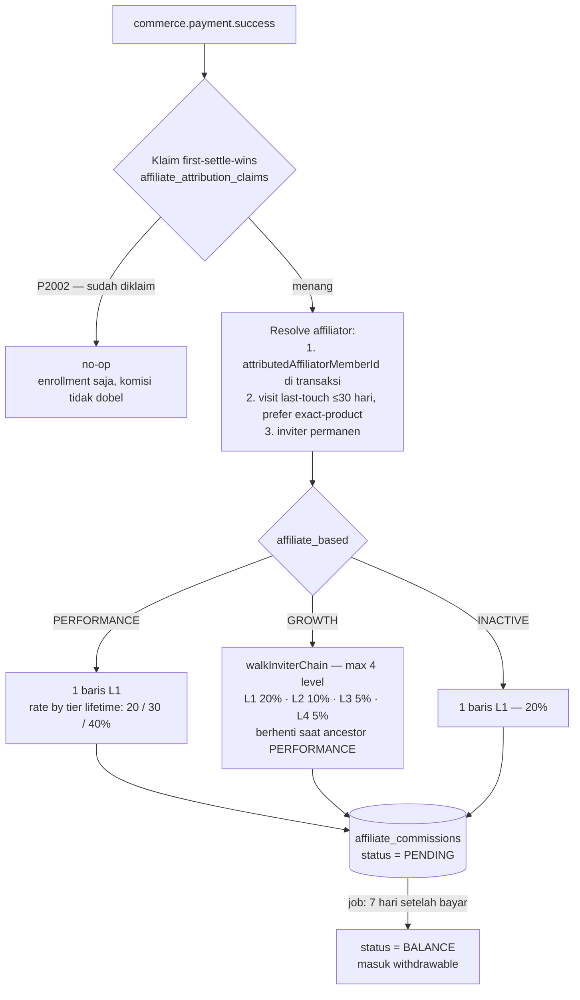

# Affiliate — Program, Attribution, Komisi, Disbursement & KYC

[⬅ Kembali ke index](../README.md)

## Overview

Mesin affiliate Brainboost: member mendaftar sebagai promoter sebuah **program** (per produk), menyebarkan link berkode, kliknya tercatat sebagai **visit** (attribution last-touch), pembelian yang teratribusi menghasilkan **komisi** ke ledger, dan saldo yang sudah cair bisa ditarik lewat **disbursement** (payout bank via Xendit) — dengan **KYC** sebagai gerbang wajib sebelum payout.

Tiga mode komisi per member (`members.affiliate_based`): **PERFORMANCE** (rate naik mengikuti akumulasi lifetime), **GROWTH** (multitier sampai 4 level ke atas), dan **INACTIVE** (flat). Angka-angka di halaman ini adalah aturan payout yang **harus dipertahankan persis** — off-by-one = bug pembayaran.

- Kode: `apps/mobile-api/src/modules/affiliate/` + `modules/commission/` (HTTP) + `packages/domain/src/affiliate/` (`AffiliateProgramService`, `AffiliatorService`, `EnrollmentService`, `VisitService`, `DisbursementService`)
- Spec desain: [`docs/specs/affiliate-attribution-plan.md`](../../specs/affiliate-attribution-plan.md), [`docs/specs/kyc-didit.md`](../../specs/kyc-didit.md), [`docs/specs/kyc-rekyc.md`](../../specs/kyc-rekyc.md)

## Endpoint

Prefix modul: `/api/member`. Semua butuh `authGuard` kecuali ditandai.

| Method | Path | Handler | Deskripsi |
|---|---|---|---|
| GET | `/api/member/affiliate/me` | `getMe` | Profil affiliator: mode, kode, program yang diikuti |
| POST | `/api/member/affiliate/me/mode` | `setMode` | Ganti mode komisi (PERFORMANCE/GROWTH) |
| GET | `/api/member/affiliate/me/summary` | `getSummary` | Dashboard: `balance` (= withdrawable), pending, lifetime |
| GET | `/api/member/affiliate/me/commissions` | `listMyCommissions` | Riwayat komisi member (paginated) |
| GET | `/api/member/affiliate/programs` | `listPrograms` | Daftar program aktif — **publik** |
| POST | `/api/member/affiliate/programs/:code/enroll` | `enroll` | Daftar jadi promoter program |
| POST | `/api/member/affiliate/visits` | `logVisit` | Log klik link affiliate — **optional-auth** (pre-login boleh); idempoten via `clientEventId` |
| POST | `/api/member/affiliate/attribution` | `logAttribution` | Catat attribution eksplisit (post-login) |
| GET | `/api/member/affiliate/me/bank-account` | `getBankAccount` | Rekening payout tersimpan |
| PUT | `/api/member/affiliate/me/bank-account` | `setBankAccount` | Set/ubah rekening — **perubahan rekening existing men-trigger re-KYC** |
| GET | `/api/member/affiliate/me/kyc` | `getKyc` | Status KYC saat ini |
| POST | `/api/member/affiliate/me/kyc` | `submitKyc` | Submit KYC manual (fallback; NIK + foto KTP + selfie) |
| POST | `/api/member/affiliate/me/kyc/token` | `createKycToken` | Mint sesi verifikasi **Didit** → `{ sessionId, sessionToken, url, kycStatus }` |
| GET | `/api/member/affiliate/me/disbursement` | `getDisbursementSummary` | `withdrawableBalance` + `minBalance` + fee |
| POST | `/api/member/affiliate/me/disbursement` | `requestDisbursement` | Request payout (gate KYC APPROVED) |
| GET | `/api/member/affiliate/me/disbursements` | `listDisbursements` | Riwayat payout |
| GET | `/api/member/data/commisionSummary` | `summary` (modul commission) | Ringkasan komisi — ejaan path mengikuti kontrak mobile legacy |

Webhook terkait (tanpa JWT, guard sendiri):

| Method | Path | Guard | Deskripsi |
|---|---|---|---|
| POST | `/api/webhook/didit` | HMAC-SHA256 raw-body `X-Signature` + `X-Timestamp` ±300s | Hasil verifikasi Didit → transisi `kycStatus` |
| POST | `/api/webhook/xendit/disbursement` | `X-Callback-Token` | Hasil payout Xendit (COMPLETED/FAILED) → PAID/FAILED |

## Tabel database

| Tabel | Peran di fitur ini |
|---|---|
| `affiliate_programs` | Program per produk; `code` 8 char = referensi publik di link |
| `member_affiliators` | Keanggotaan member ↔ program (promoter) |
| `affiliate_commissions` | Ledger komisi — 1 baris per (payment, recipient, level), unique; snapshot mode/tier/rate/harga/voucher; status `PENDING → BALANCE` / `VOIDED` |
| `affiliate_visits` | Log klik: UTM/ad/device/`installReferrer` penuh + `productId` (attribution per produk) |
| `affiliate_attribution_claims` | Guard "first settle wins" per (provider, attributionKey) — tanpa FK |
| `affiliate_disbursements` | Request payout: gross/fee/net, snapshot bank, audit approval, `externalId` idempotensi Xendit |
| `kyc_event` | Audit trail append-only transisi KYC (AML) |
| `members` (kolom `kyc_*`, `bank_*`, `affiliate_code`, `affiliate_based`, `inviter_id`) | State KYC + rekening default + identitas affiliate member (kode 6 char) |
| `app_settings` | `disbursement.minBalance`, `disbursement.fee`, `kyc.minBalance` — runtime tanpa deploy |

## Flow komisi

## Business rules

### Attribution

1. **Last-touch overwrite, window 30 hari** (`COOKIE_DAYS = 30`) — visit terbaru menang.
2. **Per-product attribution** — `affiliate_visits.product_id` diisi saat link membawa produk (OneLink). Resolver per pembelian **memprioritaskan visit exact-product**: link untuk produk X tidak pernah mengatribusi produk Y.
3. **Override per-checkout** — `commerce_transactions.attributed_affiliator_member_id` (member di balik link yang dipakai saat checkout itu) mengalahkan inviter permanen buyer. Tidak ada persistensi cookie — berlaku per checkout.
4. **First settle wins** — `affiliate_attribution_claims` unique (provider, `attributionKey` — mis. Apple `original_transaction_id`): re-settle IAP (delete+rebuy, restore, RC re-sync burst) yang mencetak `paymentId` baru kena P2002 → enrollment jalan, komisi **tidak** dibayar dua kali.
5. **Kode**: affiliate member = **6 char**, program = **8 char**, alfabet `[A-Z0-9]`.

### Komisi

1. **Formula** (`compute-amount.ts::computeAmount`, parity `TBAffiliator::getPriceRecipient`):
   `priceRecipient = floor(max(productPrice − voucherAmount, 0) × rate / 100)`
2. **Tier PERFORMANCE** — dari akumulasi penjualan lifetime, **boundary inklusif (`<=`)**:

   | Lifetime (IDR) | Rate |
   |---|---|
   | ≤ 5.000.000 | 20% |
   | ≤ 15.000.000 | 30% |
   | > 15.000.000 | 40% |

3. **GROWTH multitier** — L1 = 20%, L2 = 10%, L3 = 5%, L4 = 5%; **maksimal 4 level**. Saat menaiki rantai inviter, **berhenti begitu ketemu ancestor ber-mode PERFORMANCE** (`walkInviterChain({ stopOnPerformance: true })`).
4. **INACTIVE** — flat 20%.
5. **PENDING → BALANCE setelah 7 hari** (`PENDING_TO_BALANCE_DAYS = 7`; marketing menyebut "5 hari kerja") — job `affiliate-pending-to-balance`. Refund sebelum cair → `VOIDED`.
6. Ledger menyimpan **snapshot** (`affiliateBased`, `schemaType`, `commissionRate`, `productPrice`, `voucherAmount`) — perubahan tier/harga belakangan tidak mengubah komisi historis.

### Disbursement

1. **Withdrawable balance = single source of truth**:
   `withdrawableBalance = Σ komisi status BALANCE − Σ disbursement status ∈ {PENDING, PROCESSING, PAID}`
   (`DisbursementService.getWithdrawableBalance`). Dashboard `/affiliate/me/summary` (`balance`) dan `/affiliate/me/disbursement` (`withdrawableBalance`) memakai method yang sama → **selalu sepakat**.
2. **Ambang & fee runtime** via `app_settings`: min gross `disbursement.minBalance` (fallback 15.000), fee flat `disbursement.fee` (fallback 5.000); min **net** 10.000 tetap konstanta. `quoteDisbursement(balance, amount?, minBalance?, fee?)` menerima semuanya sebagai parameter.
3. **Gate KYC**: request payout hanya lolos bila `kycStatus === 'APPROVED'` (member legacy-APPROVED lolos; `EXPIRED` ditolak dengan pesan `'KYC perlu diperbarui'`).
4. **State**: `PENDING` (tunggu approval manual) → `PROCESSING` (Xendit dipanggil) → `PAID` / `FAILED`; plus `REJECTED`/`VOIDED`. Approval dilakukan di repo **backoffice-bb** (stamp `approved_at` via SQL); Xendit key & state machine tetap di repo ini. Job `execute-approved-disbursements` menyapu baris yang sudah di-approve dan **re-check KYC saat eksekusi**.
5. **Snapshot bank** di baris disbursement — rekening profil boleh berubah setelahnya. `externalId` unik = idempotency key ke Xendit; callback dicocokkan lewat ini.

## KYC & Re-KYC

1. **Provider baru = Didit** (session-per-attempt, tanpa applicant persisten). `POST /affiliate/me/kyc/token` membuat sesi (`vendor_data` = member UUID, `session_id` disimpan di `members.kyc_provider_ref`); mobile membuka SDK/webview Didit. Webhook men-drive status: `"In Review"`→PENDING, `"Approved"`→APPROVED, `"Declined"`→REJECTED.
2. **Webhook hanya dihormati bila `session_id == kyc_provider_ref`** — safety net terhadap webhook "Approved" basi dari sesi lama. Guard transport: HMAC-SHA256 raw-body + `X-Timestamp` ±300 detik (anti-replay).
3. **Min-balance gate KYC** (`assertBalanceForKyc`): member baru boleh memulai KYC (Didit **maupun** manual — tidak ada bypass) setelah withdrawable balance ≥ `app_settings kyc.minBalance` (fallback 0 = off; **seeded 55.000 IDR**) → jika belum: `400 'Saldo belum mencukupi untuk verifikasi KYC'`.
4. **Provenance** `members.kyc_source`: `NONE | LEGACY | MANUAL | DIDIT`. KYC legacy nyata dan termigrasi (APPROVED/REJECTED dari `member_data_kyc`; PENDING di-skip) — member legacy-APPROVED langsung lolos gate payout.
5. **Re-KYC (status `EXPIRED`)** — APPROVED dicabut oleh event risiko; gate payout hanya melewatkan APPROVED. Entry point tunggal `DisbursementService.resetKyc(memberId, reason)`: no-op kecuali sedang APPROVED, mempertahankan `kycSource`, menulis `kyc_event`, dan **mengosongkan `kyc_provider_ref`**. Empat trigger:
   - **Bank change** — `setBankAccount` mengubah rekening yang *sudah ada* (setup pertama tidak).
   - **Disbursement besar** — `netAmount ≥ 5.000.000` DAN review terakhir > 180 hari → transaksi payout dibatalkan (`ReKycRequiredError`) lalu reset.
   - **Dormant reactivation** — aktif kembali setelah gap > 365 hari (`members.last_active_at`).
   - **Suspicious** — admin memanggil `resetKyc(reason='SUSPICIOUS')`.
6. **`kyc_event` = audit AML append-only** (RESET/SUBMIT/PENDING/APPROVE/REJECT); transisi lifecycle dijaga state nyata sehingga replay webhook idempoten.

## Events & jobs

| Arah | Nama | Keterangan |
|---|---|---|
| Listen | `commerce.payment.success` | hitung & tulis komisi (flow di atas) |
| Listen | `commerce.payment.refunded` | void komisi terkait |
| Emit | `affiliate.commission.created` | notifikasi "komisi masuk" ke recipient |
| Job | `affiliate-pending-to-balance` | PENDING → BALANCE setelah 7 hari |
| Job | `execute-approved-disbursements` | eksekusi payout yang di-approve backoffice (re-check KYC) |

## Referensi

- Attribution: [`docs/specs/affiliate-attribution-plan.md`](../../specs/affiliate-attribution-plan.md) · fix over-attribution: [`docs/specs/affiliate-overattribution-fix.md`](../../specs/affiliate-overattribution-fix.md)
- KYC Didit: [`docs/specs/kyc-didit.md`](../../specs/kyc-didit.md) (+ sisi mobile: [`docs/specs/kyc-didit-mobile.md`](../../specs/kyc-didit-mobile.md))
- Re-KYC: [`docs/specs/kyc-rekyc.md`](../../specs/kyc-rekyc.md)
- Plan modul affiliate: `apps/mobile-api/src/modules/affiliate/plan.md`
- Jalur pembayaran pemicu komisi: [commerce.md](commerce.md) · komisi subscription (flat L1): [subscription.md](subscription.md)
