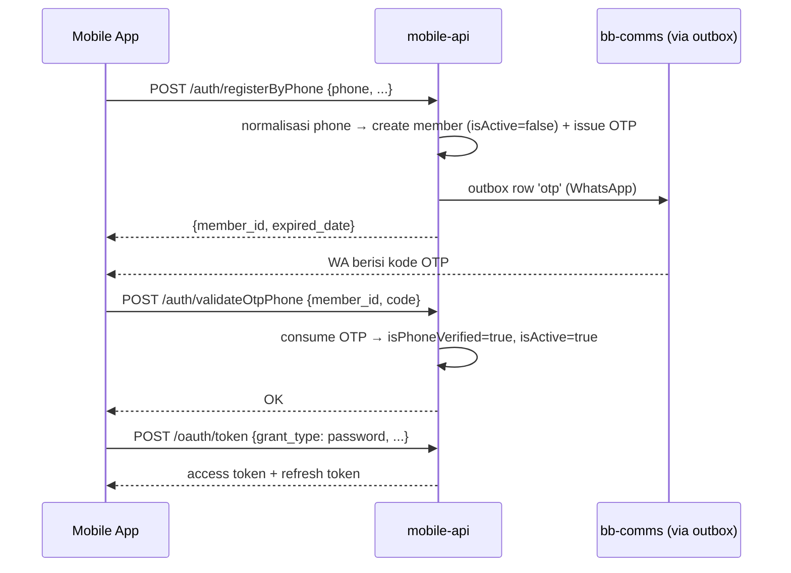

# Auth — Login, Register & Verifikasi

[⬅ Kembali ke index](../README.md)

## Overview

Autentikasi member: login gaya OAuth (dipertahankan demi kompatibilitas mobile client legacy, tapi implementasinya JWT access + refresh), register email/phone dengan model **inactive-until-verified**, forgot password, verifikasi kontak via OTP, dan registrasi device/FCM token.

Prinsip utama: member lahir **nonaktif** — baik register email maupun phone membuat row `members` dengan `isActive=false`; langkah validasi OTP-lah yang mengaktifkan. Login apa pun menolak member nonaktif.

- Kode: `apps/mobile-api/src/modules/auth/` (`AuthService` lokal modul)
- OTP terpusat di `OtpService` (`packages/common/src/services/otp.service.ts`); pengiriman WA/email lewat outbox → bb-comms
- Spec desain & sejarah: [`docs/specs/register-verification-flow.md`](../../specs/register-verification-flow.md), [`docs/specs/otp-port.md`](../../specs/otp-port.md)

## Endpoint

Prefix modul: `/api/member`. Semua endpoint pre-login **rate-limited per IP, window 15 menit** — budget-nya bertingkat sesuai risiko: tebak-OTP **3 req**, kirim/resend OTP **10 req**, register **15 req**, login **30 req** (limiter khusus per endpoint di `@bb/common/middlewares/rate-limit.middleware`; lewat budget → `429 TOO_MANY_REQUESTS`; nonaktif saat `NODE_ENV=test`).

| Method | Path | Auth | Deskripsi |
|---|---|---|---|
| POST | `/api/member/oauth/token` | — | Login semua grant: `password`, `social` (Google/Apple), `client_credentials` (token anonim), `refresh_token`. **Refresh lewat sini**, bukan `/oauth/refresh` · rate limit **30 req/15 mnt/IP** |
| POST | `/api/member/auth/register` | — | Register via email → member nonaktif + OTP `verify-email`; response `{member_id, email, expired_date}` (**bukan** token) · rate limit **15 req/15 mnt/IP** |
| POST | `/api/member/auth/registerByPhone` | — | Register via phone → member nonaktif + OTP WhatsApp · rate limit **15 req/15 mnt/IP** |
| POST | `/api/member/auth/requestVerificationPhone` | — | Resend OTP phone pre-login (by memberId) · rate limit **10 req/15 mnt/IP** |
| POST | `/api/member/auth/validateOtpPhone` | — | Konsumsi OTP phone → `isPhoneVerified=true, isActive=true` · rate limit **3 req/15 mnt/IP** |
| POST | `/api/member/auth/requestVerificationEmail` | — | Resend OTP email pre-login (mirror pasangan phone) · rate limit **10 req/15 mnt/IP** |
| POST | `/api/member/auth/validateOtpEmail` | — | Konsumsi OTP email → `isEmailVerified=true, isActive=true` · rate limit **3 req/15 mnt/IP** |
| POST | `/api/member/auth/requestForgotPassword` | — | Kirim OTP reset password — terima `email?` ATAU `phone?` (dua-duanya → email menang) · rate limit **10 req/15 mnt/IP** |
| POST | `/api/member/auth/validateOtp` | — | Pre-check OTP forgot-password (tanpa konsumsi) · rate limit **3 req/15 mnt/IP** |
| POST | `/api/member/auth/forgotPasswordVerification` | — | Konsumsi OTP + set password baru · rate limit **3 req/15 mnt/IP** |
| POST | `/api/member/auth/requestVerify` | JWT | Post-login: minta OTP verifikasi kontak, body `{type: 'email'\|'phone'}` (pengganti `requestVerifyEmail`/`verifyEmail` lama) |
| POST | `/api/member/auth/verify` | JWT | Post-login: konsumsi OTP → set `isEmailVerified`/`isPhoneVerified` |
| POST | `/api/member/auth/devices` | JWT | Registrasi device (unique per member+deviceId) |
| POST | `/api/member/auth/cloudMessaging` | JWT | Simpan/refresh token FCM device |

## Tabel database

| Tabel | Peran di fitur ini |
|---|---|
| `members` | Akun: kredensial (`passwordHash`, `googleSub`/`appleSub`), flag `isActive`/`isEmailVerified`/`isPhoneVerified`, phone kanonik (`phoneCode` + `phone`) |
| `refresh_tokens` | Refresh token per member/client; revoke saat logout |
| `otp_codes` | OTP (hash bcrypt) per `target`+`purpose`, TTL + attempt counter + resend guard |
| `devices` | Device member + `fcmToken` untuk push |
| `pra_members` | Pre-registration: menampung identitas + `attributionContext` marketing sebelum register beneran (bukan gerbang verifikasi) |
| `notification_outbox` | Baris pengiriman OTP (WA/email) → relay → Amazon SQS → bb-comms |

## Flow: register phone → aktivasi → login

Register email identik strukturnya (`/auth/register` → `/auth/validateOtpEmail`), OTP terkirim via email.

## Business rules

1. **Inactive-until-verified** — kedua jalur register membuat member `isActive=false`; `validateOtpPhone`/`validateOtpEmail` adalah titik aktivasi. Aktivasi tidak pernah menghidupkan akun yang menunggu penghapusan (`scheduledDeletionAt != null` tetap nonaktif).
2. **Reusable placeholder** — row dianggap placeholder yang boleh ditimpa register ulang (email/phone sama) iff **semua**: `legacyId=null && isActive=false && isEmailVerified=false && isPhoneVerified=false && scheduledDeletionAt=null` (predicate `isReusableUnverifiedMember`, `packages/common/src/utils/member-state.util.ts`). `legacyId != null` = akun migrasi legacy, **tidak pernah** reusable (legacy tak punya gerbang OTP — tanpa guard ini akun lama bisa di-takeover). Inilah yang membuat user yang menutup app di layar OTP bisa register ulang tanpa mentok "already registered".
3. **Login gate** — password login pada placeholder → **401 generik**. Diskriminator `403 ACCOUNT_NOT_VERIFIED` sudah ditulis tapi **dinonaktifkan** (di-comment di `loginWithPassword`); aktifkan kalau FE mau mengarahkan user ke layar OTP dari form login.
4. **Refresh token** — `POST /api/member/oauth/token` dengan `grant_type=refresh_token`. Konstanta `refreshTokenUrl` di mobile client menunjuk path yang tidak dipakai — jangan terkecoh.
5. **Phone kanonik** — kedua jalur register menormalisasi via `normalizePhonePair` sebelum lookup/simpan (`phoneCode` → `+62`, `phone` → digit tanpa 0/kode negara duplikat). Login password mencocokkan username berbentuk phone terhadap bentuk raw + kanonik, jadi `08111…`/`628111…` tetap bisa login.
6. **Re-register dalam TTL OTP** (phone, 2 menit) — kode WhatsApp yang sudah terkirim masih berlaku; response mengembalikan expiry-nya alih-alih menerbitkan OTP baru (menghindari resend guard).
7. **OTP** — kode 6 digit acak (`randomInt(100000,1000000)` — tidak pernah `000000`), disimpan sebagai hash, TTL + batas percobaan + resend guard + daily cap.
8. **Tester account fixed-OTP** (untuk review App Store/Play Store) — identifier yang masuk whitelist `TEST_ACCOUNT_IDENTIFIERS` lolos OTP apa pun dengan kode tetap **`000000`**: `issue()` tidak membuat row & tidak kirim apa-apa, `verify()`/`consume()` menerima kode fixed tanpa cek bcrypt/expiry. Kill-switch `TEST_ACCOUNT_ENABLED` (default OFF), dibaca live. **Whitelist hanya akun dummy** — identifier asli di sini = pintu reset password. Detail: [`docs/specs/test-account.md`](../../specs/test-account.md).
9. **Email nullable** — member phone-only punya `email = NULL` (skema email sintetis lama dihapus). Serializer memancarkan `email: null` — FE wajib null-check; endpoint OTP email menolak member tanpa email (400).
10. **Social login** — Google/Apple `sub` disimpan di `googleSub`/`appleSub`. Urutan error di jalur link: `email_in_use_unverified` (400) dicek **sebelum** `Member not active` (401) karena placeholder juga nonaktif dan error unverified-lah yang actionable.

## Events & jobs

Tidak ada event domain yang dipancarkan modul ini. Pengiriman OTP menumpang outbox pattern (lihat [01 — Arsitektur §3](../01-architecture.md)).

## Referensi

- Flow register + placeholder: [`docs/specs/register-verification-flow.md`](../../specs/register-verification-flow.md)
- OTP (parity legacy, WA/Qontak, normalisasi phone): [`docs/specs/otp-port.md`](../../specs/otp-port.md)
- Tester account: [`docs/specs/test-account.md`](../../specs/test-account.md)
- Operasi akun post-login (change password, logout, delete account): halaman account-profile *(menyusul)*
