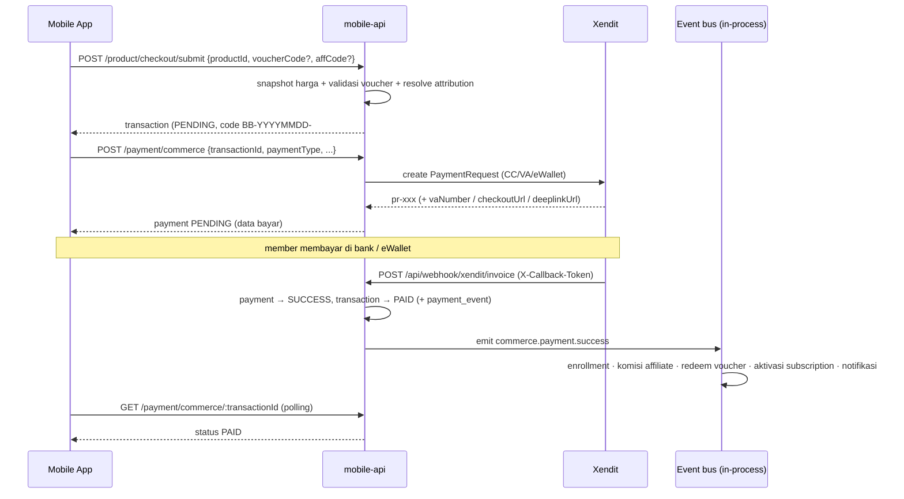
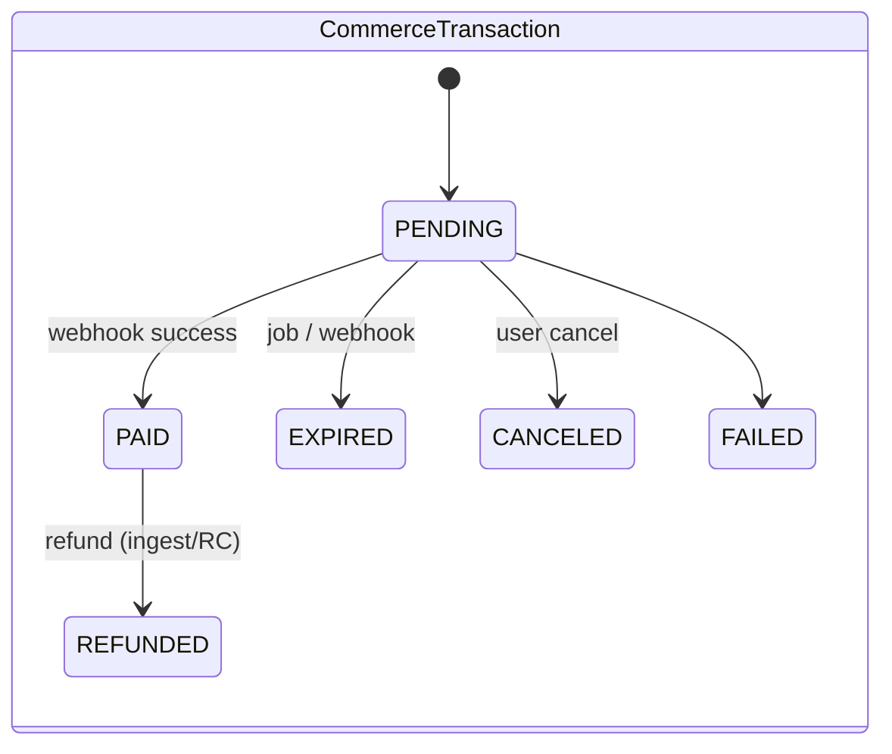

# Commerce — Checkout, Payment & Voucher

[⬅ Kembali ke index](../README.md)

## Overview

Jalur pembelian produk (course & subscription plan) via **Xendit** — kartu kredit, virtual account, dan eWallet. Modelnya **2 langkah**: checkout (buat order) → payment (pilih & eksekusi metode bayar). Tidak ada cart, tidak ada shipping; qty selalu 1.

Pembelian dari kanal lain (IAP via RevenueCat, Scalev, Lynk.id) masuk lewat jalur **ingest** (`POST /api/ingest/purchase`) dan webhook RevenueCat — berbagi tabel yang sama, dibahas terpisah di halaman tracker-ingest & [subscription](subscription.md).

- Kode: `apps/mobile-api/src/modules/commerce/` (HTTP) + `packages/domain/src/commerce/` (`CheckoutService`, `PaymentService`, `VoucherService`)
- Spec desain & sejarah: [`docs/specs/commerce-port.md`](../../specs/commerce-port.md)

## Endpoint

Semua butuh `authGuard` (Bearer JWT). Prefix modul: `/api/member`.

| Method | Path | Handler | Deskripsi |
|---|---|---|---|
| POST | `/api/member/product/checkout/submit` | `startCheckout` | Buat order (`CommerceTransaction`): snapshot harga, validasi + apply voucher, catat attribution affiliate |
| POST | `/api/member/payment/commerce` | `createPayment` | Buat payment attempt untuk order: CC / VA / eWallet / voucher-full |
| GET | `/api/member/payment/commerce/list` | `listTransactions` | Riwayat transaksi member (paginated) |
| GET | `/api/member/payment/commerce/:transactionId` | `getTransactionStatus` | Status transaksi + payment aktif (dipakai polling FE) |
| POST | `/api/member/payment/commerce/cancel` | `cancelTransaction` | Batalkan transaksi PENDING |
| POST | `/api/member/payment/voucher/validate` | `validateVoucher` | Pre-check voucher sebelum checkout — **rate limit 20 req/15 mnt per member** (fallback per IP; `voucherValidateRateLimiter`, anti enumerasi kode voucher) |

Webhook terkait (tanpa JWT, guard sendiri):

| Method | Path | Guard | Deskripsi |
|---|---|---|---|
| POST | `/api/webhook/xendit/invoice` | `X-Callback-Token` | Callback status pembayaran Xendit → transisi payment + emit event |

## Tabel database

| Tabel | Peran di fitur ini |
|---|---|
| `commerce_transactions` | Order header — snapshot `itemTotal`/`voucherAmount`/`amount`, voucher, attribution (`attributedAffiliatorMemberId`, `programId`) |
| `commerce_payments` | Attempt bayar; `activeSlotTxId` menjamin hanya satu payment PENDING/SUCCESS per transaksi (retry VA setelah expired tetap bisa) |
| `commerce_payment_events` | Audit trail transisi status (source: checkout/webhook/poll/manual) |
| `vouchers` | Master voucher (PERCENT/AMOUNT, `maxAmount`, kuota, window aktif) |
| `voucher_redemptions` | Guard idempoten: unique `transaction_id` — satu redeem per order |
| `products` | Sumber harga & status produk |
| `affiliate_visits` | Dibaca saat checkout untuk resolve attribution last-touch per produk |

## Flow utama

**Voucher menutup 100% harga** → tidak perlu Xendit: payment `paymentType='voucher'` langsung SUCCESS dan event dipancarkan di jalur checkout itu juga (bypass).

## State machine

Payment (`CommercePaymentStatus`): `PENDING → SUCCESS | EXPIRED | FAILED | CANCELED`. Payment EXPIRED/FAILED/CANCELED melepas `activeSlotTxId` → member bisa retry dengan metode lain pada transaksi yang sama.

## Business rules

1. **Snapshot saat checkout** — harga, potongan voucher, dan attribution dibekukan di `CommerceTransaction`. Perubahan harga produk setelah checkout tidak memengaruhi order berjalan.
2. **Satu payment aktif per transaksi** — kolom nullable-unique `commerce_payments.active_slot_tx_id`: Postgres menolak payment aktif kedua secara atomik; slot lepas otomatis saat payment mati.
3. **Voucher redeem idempoten per order** — `VoucherService.redeem` klaim slot di `voucher_redemptions` (unique `transactionId`) **sebelum** `UPDATE vouchers SET used = used + 1` (atomic, dengan guard kuota+window). Redelivery webhook → P2002 → no-op; `used` tidak pernah dobel. Kunci = `transactionId` (bukan `paymentId`): repurchase setelah refund adalah order baru dan sah memakan kuota lagi. Kalau increment gagal (kuota habis saat race) → claim di-rollback lalu throw.
4. **Webhook idempoten** — transisi status payment dijaga state transition nyata (PENDING→SUCCESS sekali); redelivery Xendit tercatat di `commerce_payment_events` tanpa efek ganda.
5. **Expiry** — job `expire-pending-payments` menyapu payment/transaksi PENDING yang lewat `expiredAt` → EXPIRED (+ event `commerce.payment.expired`).
6. **Side effects lewat event, bukan inline** — enrollment, komisi, voucher redeem, aktivasi subscription semuanya listener `commerce.payment.success`; masing-masing punya guard idempoten sendiri.

## Events & jobs

| Arah | Nama | Keterangan |
|---|---|---|
| Emit | `commerce.payment.success` | payload berisi `transactionId`, `paymentId` — dikonsumsi enrollment/affiliate/voucher/subscription/notification |
| Emit | `commerce.payment.expired` / `.failed` / `.refunded` | notifikasi + pembalikan efek (void komisi, putus subscription) |
| Job | `expire-pending-payments` | sweep expiry |

## Referensi

- Spec desain: [`docs/specs/commerce-port.md`](../../specs/commerce-port.md)
- Envelope API: [`docs/specs/api-envelope.md`](../../specs/api-envelope.md)
- Aturan komisi yang dipicu pembayaran: halaman affiliate *(menyusul)* — sementara lihat `CLAUDE.md §5`
- Aktivasi subscription dari pembayaran: [subscription.md](subscription.md)
