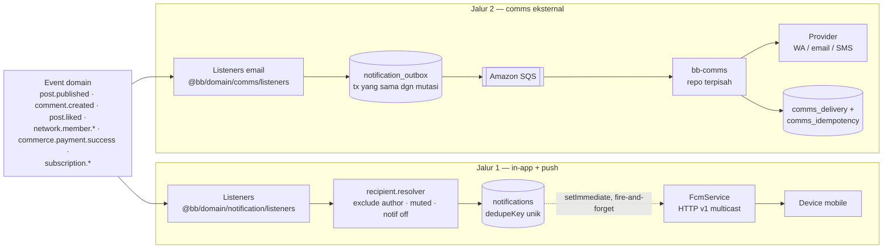

# Notification — Feed In-app, FCM Push & Outbox Comms

[⬅ Kembali ke index](../README.md)

## Overview

Sistem notifikasi punya **dua jalur yang berbeda** — jangan tertukar:

1. **In-app + push (jalur ini)** — event domain (post, comment, like, network, commerce) → listener membuat baris `notifications` (feed yang dibaca mobile app) lalu mengirim **FCM v1 push** fire-and-forget ke device member. Judul/body push berbahasa Indonesia.
2. **Comms eksternal (WA/email/SMS)** — transactional outbox: producer menulis `notification_outbox` dalam transaksi yang sama dengan mutasi domain → relay mem-publish ke Amazon SQS → dieksekusi repo terpisah **bb-comms** (ADR-0002). Backend ini tidak pernah memanggil provider email/WA langsung.

Catatan status: `apps/notification-worker` saat ini masih shell kosong (belum ada kode) — push FCM dieksekusi **in-process dari mobile-api** via `setImmediate` (tidak nge-block request). Migrasi ke queue RabbitMQ untuk push sengaja ditunda (lihat [`docs/specs/notification-port.md`](../../specs/notification-port.md) §12).

- Kode: `apps/mobile-api/src/modules/notification/` (HTTP) + `packages/domain/src/notification/` (`NotificationService`, `NotificationProducer`, `FcmService`, `recipient.resolver`, `listeners/`) + `packages/domain/src/comms/listeners/` (email transaksional)
- Spec desain & fase: [`docs/specs/notification-port.md`](../../specs/notification-port.md)

## Endpoint

Semua butuh `authGuard` (Bearer JWT). Prefix modul: `/api/member`.

| Method | Path | Handler | Deskripsi |
|---|---|---|---|
| GET | `/api/member/notification/list` | `list` | Feed notifikasi member (paginated) |
| POST | `/api/member/notification/seen` | `seen` | Tandai notifikasi sudah dilihat/dibaca (`seenAt`/`readAt`) |
| POST | `/api/member/notification/mute` | `mute` | Mute notifikasi per scope+ref (mis. sebuah post/network) |
| POST | `/api/member/notification/unmute` | `unmute` | Cabut mute |

Tidak ada endpoint "create" — notifikasi hanya lahir dari listener event di server.

## Tabel database

| Tabel | Peran di fitur ini |
|---|---|
| `notifications` | Feed in-app per member; `dedupeKey` unik = guard duplikat saat event re-emit; `seenAt`/`readAt` state baca |
| `notification_mutes` | Mute per (member, scope, ref) — dicek recipient resolver sebelum menulis |
| `devices` | Sumber `fcmToken` target push; token `UNREGISTERED` dihapus otomatis oleh `FcmService` |
| `notification_outbox` | Outbox transaksional pesan eksternal (WA/email/SMS): `type` (template), `channel`, `status PENDING→SENT/FAILED` |
| `comms_delivery` | Log attempt kirim — **ditulis bb-comms**, satu baris per attempt (observability/audit) |
| `comms_idempotency` | Guard double-send bb-comms saat redelivery at-least-once |

## Flow

Hook point utama (detail lengkap: port-doc §6): post publish → `newPost` ke member network; comment/reply → `newComment`/`newReply` + `tag` untuk mention; like → `newLike`; network join-request/approve → `requestJoin`/`approveJoin`/`memberJoin`; payment sukses → `paymentSuccess` (buyer) + `commissionEarned` (per affiliator); subscription lifecycle → notif + email.

## Business rules

1. **Dedupe via `dedupeKey`** — `NotificationProducer.createForMember` menangkap `P2002` → silent skip (`null`). Event re-emit (webhook redelivery, retry) tidak menghasilkan notifikasi ganda.
2. **Push tidak boleh mengganggu request** — FCM dipanggil `setImmediate` setelah row tertulis, tanpa `await`, tanpa retry; gagal push = feed in-app tetap ada. Token yang dibalas `UNREGISTERED` oleh FCM → baris `Device` dihapus.
3. **Hormati preferensi member** — `member.notificationsEnabled=false` → producer skip total; `notification_mutes` per scope+ref menyaring recipient di resolver (mute post ≠ mute network).
4. **Recipient resolver mengecualikan diri sendiri** — author/actor tidak menerima notifikasi atas aksinya sendiri; resolve satu round-trip Prisma per event.
5. **Outbox = transaksi yang sama dengan mutasi domain** — tidak ada dual-write race: kalau mutasi rollback, pesan ikut batal. Id baris outbox menjadi message id idempotensi di bb-comms.
6. **Konten push Bahasa Indonesia** — judul/body FCM diterjemahkan (parity keputusan produk); template WA/email milik bb-comms.

## Referensi

- Spec desain, hook points, rencana RabbitMQ: [`docs/specs/notification-port.md`](../../specs/notification-port.md)
- Pemisahan repo comms + outbox: [`docs/adr/`](../../adr/) (ADR-0002) dan [`docs/specs/email-scope.md`](../../specs/email-scope.md)
- Event yang memicu notifikasi: [01 — Arsitektur §6](../01-architecture.md#6-event-bus-in-process)
