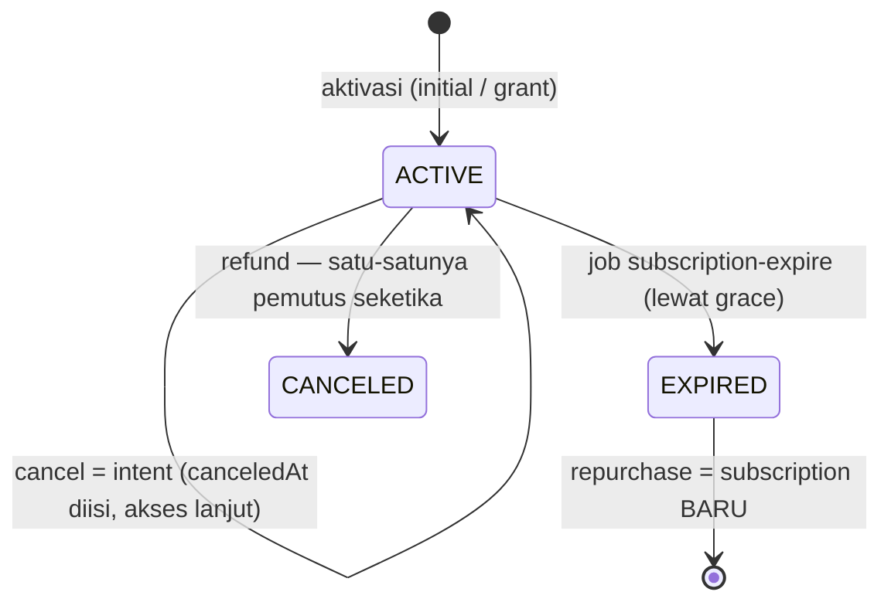

# Subscription — Phase 1 (Annual, Seat-based)

[⬅ Kembali ke index](../README.md)

## Overview

Langganan **all-access tahunan** dengan model seat ala Spotify Family. 4 tier — SOLO (1 seat), DUO (2), FAMILY (4), PREMIUM (6 seat), 999K–2.799K IDR. Pemegang seat pada subscription aktif berhak mengakses **semua course**.

Keputusan desain kunci: tiap plan adalah `Product` dengan `type='subscription'`, 1:1 ke `subscription_plans`, dan **harga tetap di `products.price`** — sehingga checkout, voucher, verifikasi paid-amount Xendit, dan webhook memakai jalur [commerce](commerce.md) tanpa perubahan. Phase 2/3 (6 bulan / bulanan) = tambah row plan, zero-code.

- Kode: `apps/mobile-api/src/modules/subscription/` (HTTP) + `packages/domain/src/subscription/` (`SubscriptionService`, `SeatService`, `EntitlementService`)
- Spec penuh + runbook launch + query reporting: [`docs/specs/subscription-port.md`](../../specs/subscription-port.md) · PRD: [`docs/specs/prd-subscription-backend.md`](../../specs/prd-subscription-backend.md)

## Endpoint

Prefix modul: `/api/subscription`.

| Method | Path | Auth | Deskripsi |
|---|---|---|---|
| GET | `/api/subscription/plans` | Publik | Daftar plan aktif — dipakai paywall sebelum login |
| GET | `/api/subscription/me` | JWT | Subscription + seat milik member (sebagai owner maupun pemegang seat) |
| POST | `/api/subscription/seats/invite` | JWT | Owner generate/rotate invite code untuk slot kosong |
| POST | `/api/subscription/seats/claim` | JWT | Claim seat pakai invite code (single-use) |
| DELETE | `/api/subscription/seats/:seatId` | JWT | Owner mengeluarkan pemegang seat |
| POST | `/api/subscription/seats/leave` | JWT | Pemegang seat keluar sendiri |
| POST | `/api/subscription/cancel` | JWT | Cancel-intent: matikan auto-renew, akses jalan terus sampai expiry |

Jalur masuk pembayaran (bukan endpoint modul ini):

| Kanal | Jalur |
|---|---|
| Web/app checkout (Xendit) | Jalur commerce biasa → listener `commerce.payment.success` mengaktivasi |
| IAP iOS/Android | `POST /api/webhook/revenuecat` (guard shared-secret) — SKU store di-resolve via `products.ios_product_id`/`android_product_id` |
| Grant kampanye | Script grant (lihat runbook di `subscription-port.md`) |

## Tabel database

| Tabel | Peran |
|---|---|
| `subscription_plans` | Definisi tier: `seatCount`, `periodMonths`, `affiliateRate` (first sale), `renewalAffiliateRate` |
| `member_subscriptions` | Satu row per subscription owner; **partial unique: satu ACTIVE per owner**; `graceUntil`, `canceledAt`, `providerRef` (RC original_transaction_id) |
| `subscription_seats` | Slot pre-provisioned saat aktivasi (`seatCount` row; seat 1 = owner). Claim = conditional UPDATE `(inviteCode, memberId IS NULL)`; **partial unique: satu seat terisi per member** |
| `subscription_activations` | Ledger idempoten + audit: satu row append-only per perubahan expiry (`kind`: initial/renewal/grant/plan_change); partial unique `transaction_id` |
| `subscription_reminder_logs` | Dedupe reminder — unique (subscription, expiresAt, daysBefore); renewal memindah `expiresAt` → otomatis re-arm siklus baru |
| `course_enrollment` | Baris lazy-enrollment dibuat on-access dengan marker `via_subscription_id` |
| `products` | Harga plan + SKU store |

## Konsep inti

### Entitlement

> Member **entitled** ⇔ memegang seat pada subscription `status=ACTIVE` dengan `coalesce(grace_until, expires_at) > now`.

Grace period = setting runtime `subscription.graceDays` (default 7 hari) — napas untuk bayar, dievaluasi `EntitlementService`.

### Aturan enrollment

Interaksi subscription ↔ `course_enrollment` (aturan paling rawan salah — hafalkan):

| Jenis row | Marker `via_subscription_id` | Validitas |
|---|---|---|
| Retail / legacy | `NULL` | Valid **by existence** — `expired_date` DIABAIKAN (migrasi legacy mengisi expired_date pada pembelian lifetime) |
| Lazy (dari subscription) | terisi | Valid hanya selama `expired_date > now` |

- Row lazy dibuat **on-access**, `expired_date` mengikuti expiry subscription, di-bump saat renewal, di-nol-kan saat remove/leave/refund.
- Beli retail atas course yang tadinya lazy → marker dibersihkan = **upgrade jadi lifetime**.

### Idempotensi aktivasi

Ledger `subscription_activations` (unique partial `transaction_id`) di-insert **terakhir** dalam transaksi aktivasi: redelivery webhook → P2002 pada kolom itu → seluruh tx rollback → no-op. Expiry tidak pernah dobel-extend.

## Lifecycle

Aturan lifecycle:

1. **Renewal anchor ke expiry lama** — `newExpiresAt = expiresAt + period`, bukan dari tanggal bayar. Grace adalah napas bayar, bukan bonus waktu (amandemen BB-79). Race dengan expire: expiry menang.
2. **Cancel = intent** — `canceled_at` terisi, auto-renew mati, akses tetap sampai expiry. **Refund** satu-satunya yang memutus akses seketika (→ CANCELED + enrollment lazy dinolkan).
3. **Repurchase pasca-EXPIRED = subscription baru** (row baru), bukan menghidupkan yang lama.
4. **Plan change hanya via RevenueCat `PRODUCT_CHANGE`**; jalur web menolak (400) selama masih ada subscription ACTIVE.

## Business rules lain

- **Komisi affiliate flat L1-only** dari plan: `affiliateRate` (40%) untuk first sale; renewal pakai `renewal_affiliate_rate` (runtime, placeholder 20% menunggu keputusan COO). Renewal terdeteksi via flag RC ATAU keberadaan ledger non-NULL sebelumnya; **grant tidak menghasilkan komisi**. `attributionKey` dibuat per-periode untuk produk plan.
- **Urutan job sakral: expire SEBELUM reminder** — supaya subscription yang sudah mati tidak dikirimi reminder. Reminder = insert-first ke `subscription_reminder_logs` + suppression per siklus expiry.
- **Grant kampanye ≥ 2jt**: eligibility dicek dari `commerce_transactions` PAID **plus** query langsung ke legacy MariaDB (`LEGACY_DB_*`; `payment_amount` sering NULL → pakai `amount − amount_voucher`). Guard: ledger `kind='grant'` sekali seumur kampanye.

## Events & jobs

| Arah | Nama | Keterangan |
|---|---|---|
| Emit | `subscription.activated` / `.renewed` / `.canceled` / `.expired` | notifikasi in-app + email via outbox |
| Listen | `commerce.payment.success` | aktivasi/renewal saat produk yang dibayar adalah plan |
| Listen | `commerce.payment.refunded` | putus seketika + nolkan enrollment lazy |
| Job | `subscription-expire` | tutup subscription lewat grace (jalan lebih dulu) |
| Job | `subscription-renewal-reminder` | reminder H-7/H-3/H-1 (`app_settings subscription.reminderDaysBefore`) |

## ⚠️ Pending eksternal (per 2026-07)

- ✅ ~~3 template email di bb-comms~~ — selesai (BB-111, bb-comms commit `0b5f561`)
- SKU di App Store / Play Store + konfigurasi RevenueCat belum final
- Rate komisi renewal final menunggu COO

## Referensi

- Spec penuh + runbook: [`docs/specs/subscription-port.md`](../../specs/subscription-port.md)
- PRD: [`docs/specs/prd-subscription-backend.md`](../../specs/prd-subscription-backend.md)
- Webhook RevenueCat: [`docs/specs/revenuecat-webhook-port.md`](../../specs/revenuecat-webhook-port.md)
- Jalur pembayaran: [commerce.md](commerce.md)
